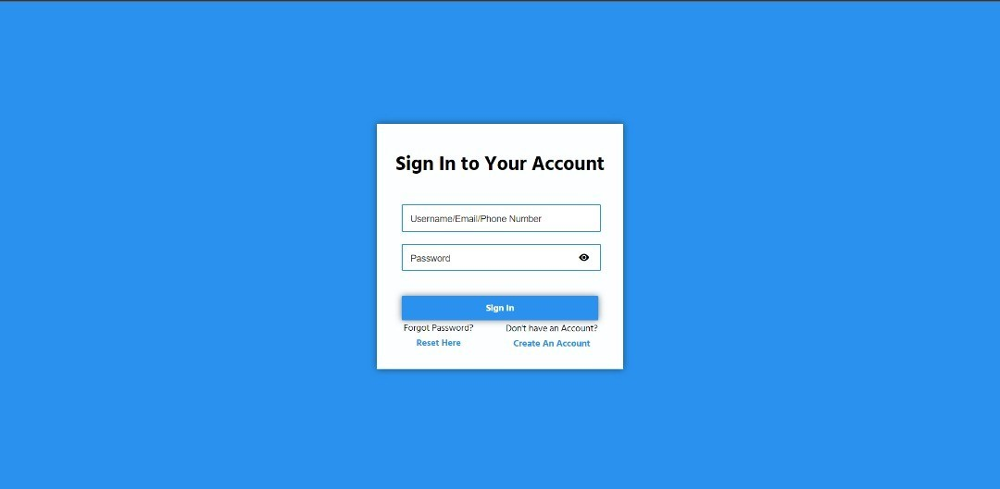
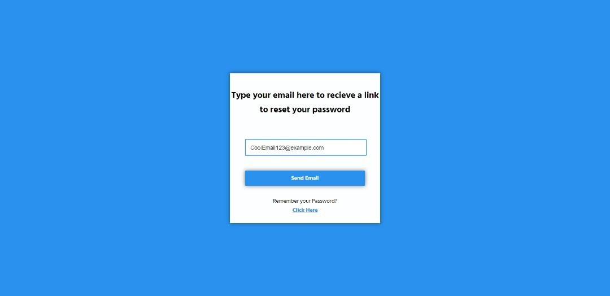
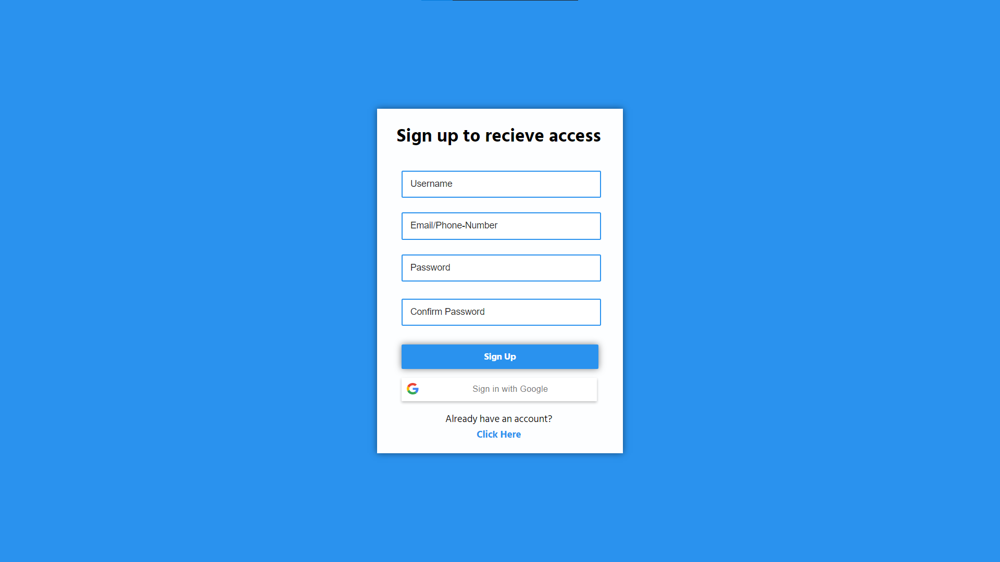

## Modern Rustic Login, Sign Up, Forgot password
# Features

This is a simple, modern, and easy to use UI template that is built with HTML, CSS and JavaScript. It is fully responsive and works on all devices. It is also very easy to customize and use. It is built with the latest technologies and is very fast and lightweight. 

# Screenshots

 

 

# Installation

1. Download the files from the repository
2. Open the index.html file in your browser
3. Enjoy!

# License

MIT License

Copyright (c) [2022] [Johnathan M.]

Permission is hereby granted, free of charge, to any person obtaining a copy
of this software and associated documentation files (the "Software"), to deal
in the Software without restriction, including without limitation the rights
to use, copy, modify, merge, publish, distribute, sublicense, and/or sell
copies of the Software, and to permit persons to whom the Software is
furnished to do so, subject to the following conditions:

The above copyright notice and this permission notice shall be included in all
copies or substantial portions of the Software.

THE SOFTWARE IS PROVIDED "AS IS", WITHOUT WARRANTY OF ANY KIND, EXPRESS OR
IMPLIED, INCLUDING BUT NOT LIMITED TO THE WARRANTIES OF MERCHANTABILITY,
FITNESS FOR A PARTICULAR PURPOSE AND NONINFRINGEMENT. IN NO EVENT SHALL THE
AUTHORS OR COPYRIGHT HOLDERS BE LIABLE FOR ANY CLAIM, DAMAGES OR OTHER
LIABILITY, WHETHER IN AN ACTION OF CONTRACT, TORT OR OTHERWISE, ARISING FROM,
OUT OF OR IN CONNECTION WITH THE SOFTWARE OR THE USE OR OTHER DEALINGS IN THE
SOFTWARE.

# Contact

If you have any questions, feel free to make an issue to contact me. There will be a questions section to on GitHub issues that you can create yourself stating your question.

# Credits

- [LarryTheFatCat](https://www.github.com/larrythefatcat/)
- [Unlicense](https://mit-license.org/)

# Support

Have any issues? Feel free to open an issue on the GitHub repository and I will try to fix it as soon as possible.

# Contributing

Feel free to contribute to this project by opening a pull request on the GitHub repository. I will review it and merge it if it is good.
# Notes

Just so you guys know if you do wanna use this, there are a couple things to change

## Changes For Real Time Use

A possible change that you can do for real time use is to add a data-site key as well as to look over the docs provided by Google 
[Right-Here](https://developers.google.com/identity/sign-in/web/build-button)

Change this so you can link to a proper domain so the reCaptchaV2 Badge will actually work and not give you an error.

Link the Buttons to a main page, follow color pattern so it actually looks good...
## Minor changes you can do.

Currently, the google sign in thing is broken, I don't really know how to fix it it just goes to the error screen, you can fix that yourself by going to google cloud and creating ur own credentials and stuff. I don't really know how to do that, so I just left it as is. 

You can also change the colors of the buttons and stuff, I just left it as is.

Want to debug to test the google sign in button? Try this script, testing this on your own platform with the google sign in
button will allow you to log the info of yourself and show it in console for testing purposes if you wish to know if it actually
works or not!

               <!-- --> <!--@Future purposes, use this if continue to make full stack app!-->

How to use the authentication:

The authentication I have provided comes in 2 ways, one with Regex, a very secure and fast way of processing data and checking for validation, the second way is also using Regex but using a specific pattern it must follow, so that means it won't actually check for a valid email, it will just check if actually uses @ and . in the email, and if it does, it will return true, if not, it will return false. You can change that by going to script.js and rewriting the entire __check__ function to your liking, as well as the pattern in forgotpassword.html.