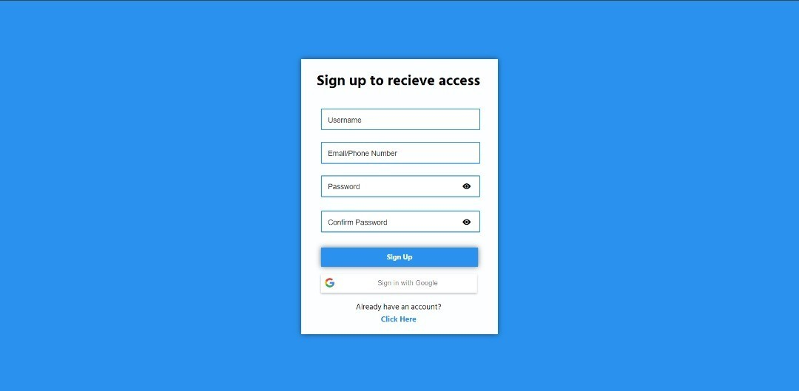

## Modern Rustic Login, Sign Up, Forgot password, and main screen UI

# Features

This is a simple, modern, and easy to use UI template that is built with HTML, CSS and JavaScript. It is fully responsive and works on all devices. It is also very easy to customize and use. It is built with the latest technologies and is very fast and lightweight. 

# Screenshots

 
<<<<<<< HEAD

 

=======

 

>>>>>>> 409475d63c8c136b4b6c0fdb2053a3e4f89cbdcd
# Installation

1. Download the files from the repository
2. Open the index.html file in your browser
3. Enjoy!

# License

This is free and unencumbered software released into the public domain.

Anyone is free to copy, modify, publish, use, compile, sell, or
distribute this software, either in source code form or as a compiled
binary, for any purpose, commercial or non-commercial, and by any
means.

In jurisdictions that recognize copyright laws, the author or authors
of this software dedicate any and all copyright interest in the
software to the public domain. We make this dedication for the benefit
of the public at large and to the detriment of our heirs and
successors. We intend this dedication to be an overt act of
relinquishment in perpetuity of all present and future rights to this
software under copyright law.

THE SOFTWARE IS PROVIDED "AS IS", WITHOUT WARRANTY OF ANY KIND,
EXPRESS OR IMPLIED, INCLUDING BUT NOT LIMITED TO THE WARRANTIES OF
MERCHANTABILITY, FITNESS FOR A PARTICULAR PURPOSE AND NONINFRINGEMENT.
IN NO EVENT SHALL THE AUTHORS BE LIABLE FOR ANY CLAIM, DAMAGES OR
OTHER LIABILITY, WHETHER IN AN ACTION OF CONTRACT, TORT OR OTHERWISE,
ARISING FROM, OUT OF OR IN CONNECTION WITH THE SOFTWARE OR THE USE OR
OTHER DEALINGS IN THE SOFTWARE.

For more information, please refer to <https://unlicense.org>

# Contact

If you have any questions, feel free to contact me on Discord as I am always active there

Discord: 'Two#6969'

# Credits

- [Two](https://www.GitHub.com/twothreetwo/)
- [Unlicense](https://unlicense.org/)

# Support

Have any issues? Feel free to open an issue on the GitHub repository and I will try to fix it as soon as possible.

# Contributing

Feel free to contribute to this project by opening a pull request on the GitHub repository. I will review it and merge it if it is good.

# Todo List

- [x] Add Screenshots for: Sign up, and Forgot password screens
- [x] Check for bugs
- [x] Auto Assign labels and users for issues/features and pull requests
- [x] Fully complete issue templates
- [x] Fully complete pull request templates
- [x] Add a Pull request auto assign label and user feature
- [x] Finish Sign up screen
- [ ] Finish Forgot password screen
- [x] Add google sign up button
- [x] Fix google sign up error screen
- [x] Add box shadowing to buttons
- [x] Organize CSS into sections and add comments
- [ ] Move alerts to the sides to the bottom of the inputs in deep red with shaking animation
- [ ] Add Main Screen UI
- [ ] When user signs up and brings it to main screen UI, add a welcome message to the top of the screen
- [ ] When User signs up and brings it to main screen UI, have it show a "Welcome" and then grab user contents name and display it. For example, if the user's name is "John Doe", it would say "Welcome John Doe"
- [ ] Add a "Sign out" button to the top right of the screen (main Screen)

